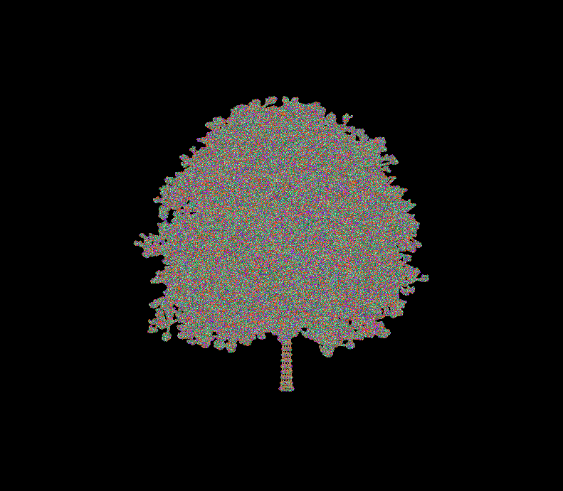
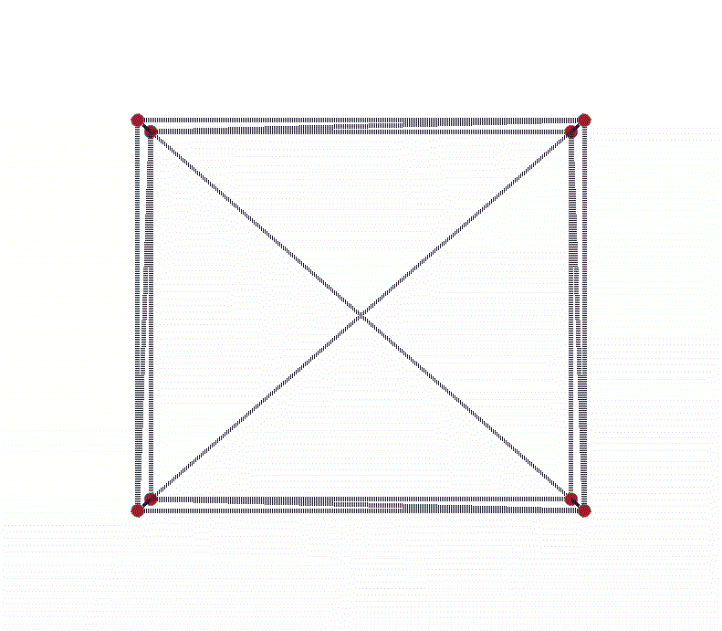
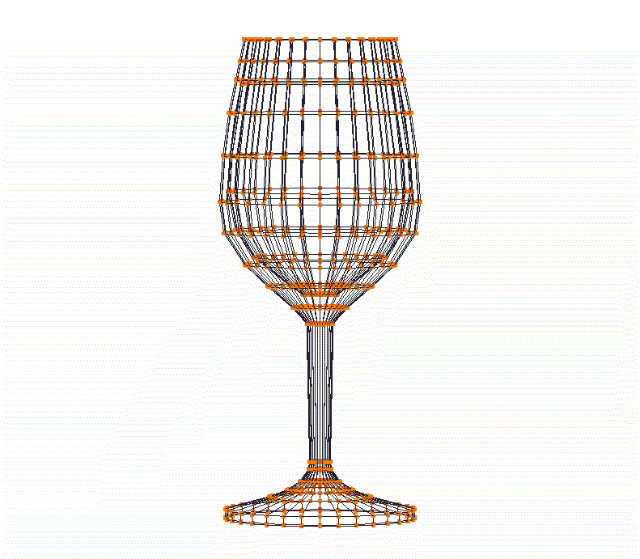

# Программа "3DViewer"

# :triangular_ruler: Программа "3DViewerV2"

 

Разработана: **peragmat** и **dkultyshkina**

**3D Viewer V2** - это приложение, которое поддерживает различные функции: просмотр файлов формата .obj и другие возможности для работы с выбранной пользователем 3D моделью

 

 GIF-изображение модели города с использованием приложения 3DViewer 

 

## 1. Назначение программы

Данная программа предназаначена для выполнения **следующих функций**:

- загрузки каркасных моделей из файла формата obj с поддержкой списка вершин и поверхностей;
- перемещения выбранной каркасной модели на заданное расстояние относительно осей X, Y, Z;
- поворота выбранной каркасной модели на заданный угол относительно своих осей X, Y, Z;
- маштабирования каркасной мoдели на заданное значение.

Программа разработана на языке C++ стандарта C++17, с использованием паттерна MVC c тремя различными паттернами проектирования: фасад, стратегия, строитель.

 

 GIF-изображение модели дерева с использованием приложения 3DViewer 

 

Для удобства взаимодействия пользователя с программой был разработан графический интерфейс, который содержит:

- кнопку для выбора файла с моделью и поле для вывода его названия;
- зону визуализации каркасной модели;
- кнопки и поля ввода для перемещения модели;
- кнопки и поля ввода для поворота модели;
- кнопки и поля ввода для масштабирования модели;
- информацию о загруженной модели - название файла, количество вершин и ребер.

В качестве специального режима реализованы "настройки", которые позволяют:

- настраивать тип проекции (параллельная и центральная);
- настраивать тип (сплошная, пунктирная), цвет и толщину ребер, способ отображения (отсутствует, круг, квадрат), цвет и размер вершин;
- выбирать цвет фона;
- сохранять настройки между перезапусками программы.

В качестве специального режима реализована "запись", которая: 

- позволяет сохранять полученные изображения в файл в форматах bmp и jpeg
- позволяет по специальной кнопке записывать небольшие скрины - текущие пользовательские аффинные преобразования загруженного объекта в gif-анимацию

 

 GIF-изображение модели куба с использованием приложения 3DViewer 

 

## 2. Условия выполнения программы

- Операционная система - **MacOS**, **LinuxOs**.

 

 GIF-изображение модели куба с использованием приложения 3DViewer 

 

## 3. Выполнение программы

### Для выполнения программы требуется установить ее. Это можно сделать, выполнив следующую последовательность действий:

 

- Необходимо ввести **make install** в командной строке в рабочем каталоге **3DViewerV2/src** и нажать **Enter**;
- После загрузки перейти в созданный каталог **build**;
- Открыть приложение **"3DViewerV2"**.

 

### Для завершения работы программы нажать красную кнопку с крестиком на верхней панели приложения. Для удаления приложения:

 

- Необходимо ввести **make uninstall** в командной строке в рабочем каталоге **3DViewerV2/src** и нажать **Enter**;
- Далее ввести **make clean** в командной строке в рабочем каталоге **3DViewerV2/src** и нажать **Enter**.

 

### Для помещения компонентов программы в архив:

 

- Необходимо ввести **make dist** в командной строке в рабочем каталоге **3DViewerV2/src** и нажать **Enter**.

 

### Для проведения тестов над программой требуется:

- Необходимо ввести **make tests** в командной строке в рабочем каталоге **3DViewerV2/src** и нажать **Enter**.

 

### Для просмотра отчета с покрытием тестами программы требуется:

- Необходимо ввести **make gcov_report** в командной строке в рабочем каталоге **3DViewerV2/src** и нажать **Enter**.

 

### Для просмотра отчета с покрытием тестами программы требуется:

- Необходимо ввести **make gcov_report** в командной строке в рабочем каталоге **3DViewerV2/src** и нажать **Enter**.

 

### Для просмотра соответствия кода с Google-style:

- Необходимо ввести **make clang-format** в командной строке в рабочем каталоге **3DViewerV2/src** и нажать **Enter**.

 

### Для просмотра текста программы на утечки на *Linux*

- Необходимо ввести **make valgrind** в командной строке в рабочем каталоге **3DViewerV2/src** и нажать **Enter**.

 

### Для очистки рабочего каталога 

- Необходимо ввести **make clean** в командной строке в рабочем каталоге **3DViewerV2/src** и нажать **Enter**.

 

### Для просмотра документации

- Необходимо ввести **make dvi** в командной строке в рабочем каталоге **3DViewerV2/src** и нажать **Enter**.

 

 GIF-изображение модели бокала с использованием приложения 3DViewer 

 